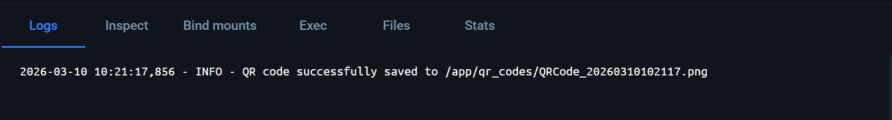
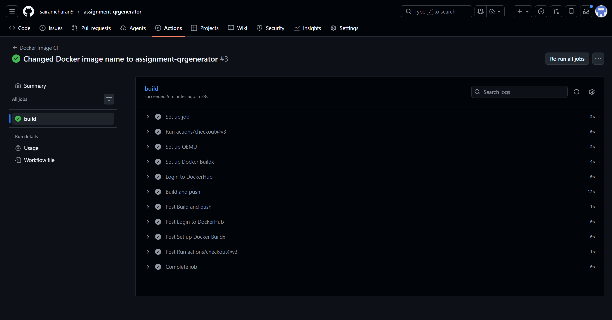

# Dockerized QR Code Generator

This repository contains the Dockerized version of the QR Code Generator application, created as part of the assignment requirements. 

## Student Information
- **Name:** SAI RAM CHARAN 
- **GitHub Username:** sairamcharan9
- **DockerHub Repository:** sb2853/assignment-qrgenerator

---

## Grading Deliverables

### 1. GitHub Repository Link
The link to this repository:
https://github.com/sairamcharan9/assignment-qrgenerator

### 2. DockerHub Image Link
The link to the Docker Hub image:
https://hub.docker.com/r/sb2853/assignment-qrgenerator

### 3. Required Screenshots

#### A. Container Logs
This screenshot demonstrates that the Docker container ran successfully and the application operated as expected by generating a QR code.



#### B. GitHub Actions Workflow
This screenshot demonstrates a successful automated run of the workflow consisting of testing and building the Docker image.



### 4. Reflection Document
The detailed reflection addressing the experiences and challenges faced during Dockerization can be found here:
[reflection.md](./reflection.md)

---

## Instructions for Running the Application Locally

**1. Clone the repository:**
```bash
git clone https://github.com/sairamcharan9/assignment-qrgenerator.git
cd assignment-qrgenerator
```

**2. Build the Docker Image:**
```bash
docker build -t assignment-qrgenerator .
```

**3. Run the Container with Volume Mapping (to save the QR code locally):**
```bash
docker run -d --name qr-generator -v "${PWD}/qr_codes:/app/qr_codes" assignment-qrgenerator --url https://github.com/sairamcharan9
```
